# 异宠小愈（ExoPet）

垂直异宠领域的一站式医疗服务平台，覆盖 **AI 问诊 → 真人兽医 → 急诊视频 → 健康管理** 完整闭环。基于 Spring Cloud Alibaba 微服务架构 + Spring AI 大模型能力 + Vue 3 移动端。

## 📱 运行界面

<p align="center">
  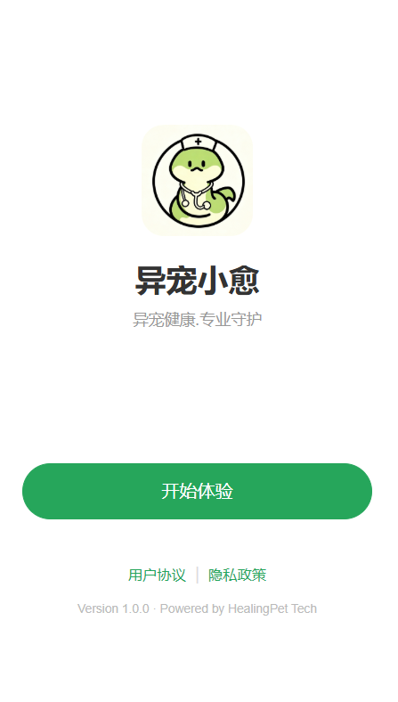
  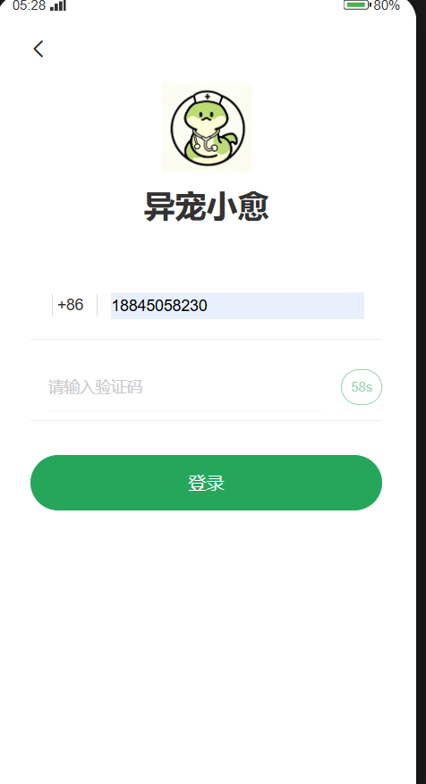
  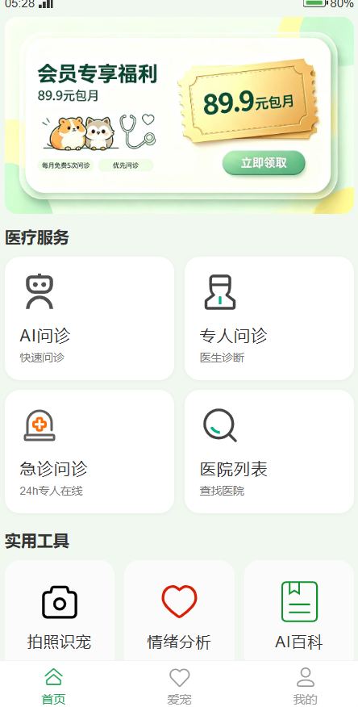
  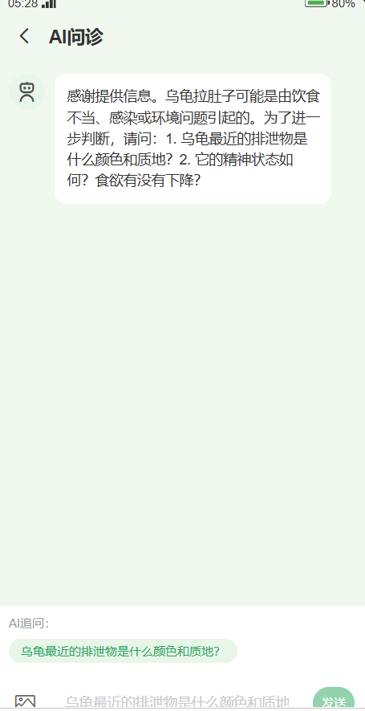
  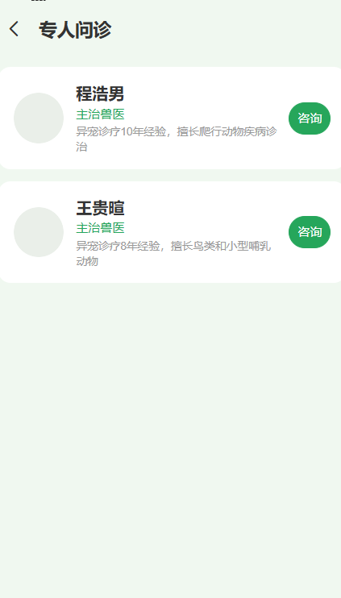
  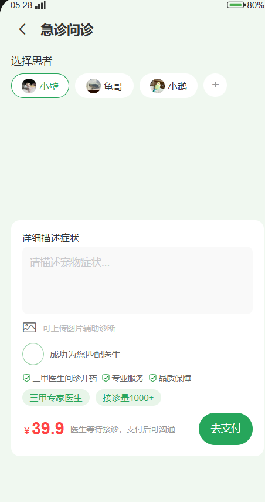
  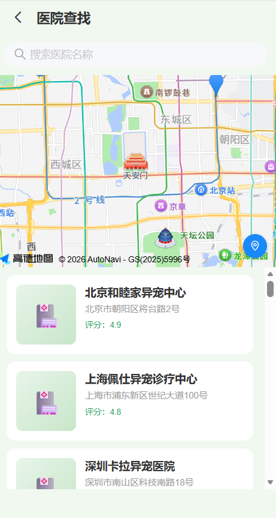
  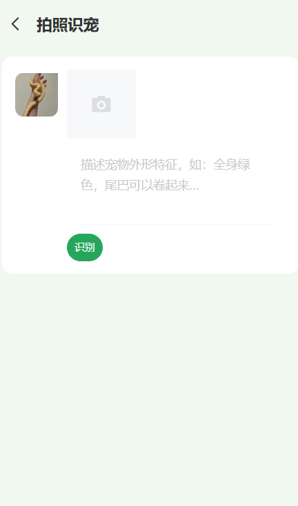
  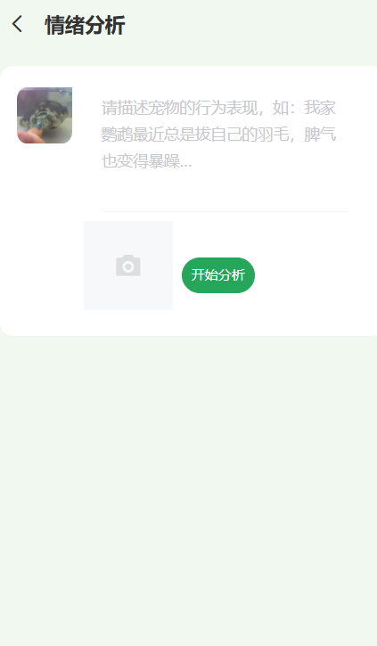
  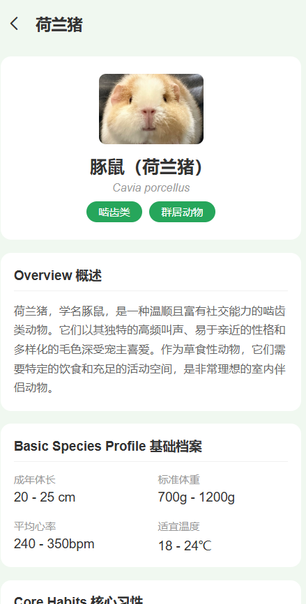
  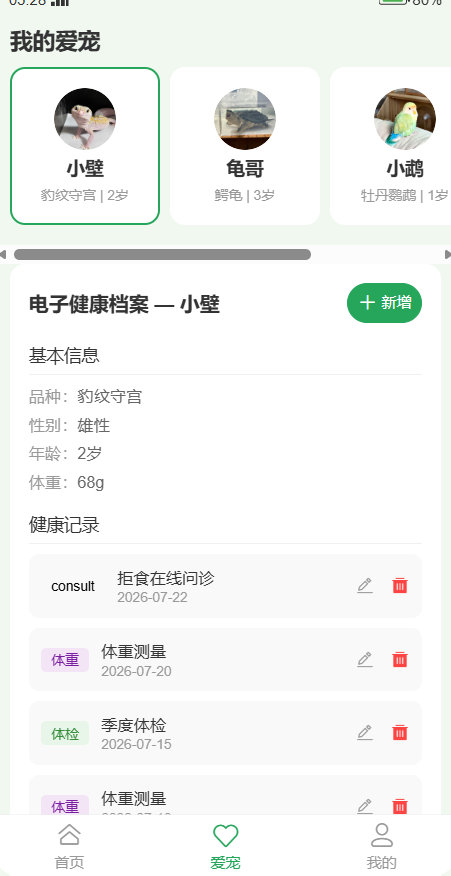
  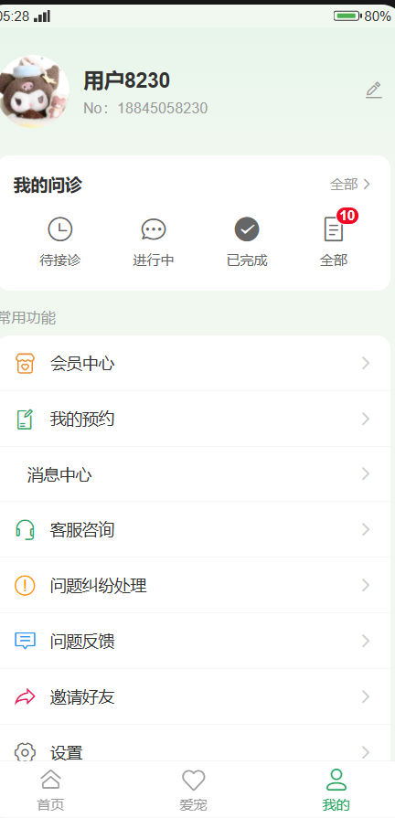
</p>

## ✨ 功能特性

- 🤖 **AI 问诊**：Spring AI + 多模态大模型（硅基流动 SiliconFlow · Qwen3-VL），支持智能诊断、情绪分析、拍照识宠
- 🩺 **真人兽医**：医生管理、问诊下单、WebSocket 实时聊天（含模拟医生自动回复）、评价体系
- 🏥 **医院服务**：医院信息管理、预约挂号、评价
- 🐾 **宠物档案**：宠物档案、病例管理、健康记录、日常提醒
- 🏷️ **认证授权**：Spring Security + JWT 统一鉴权，Gateway 网关路由/鉴权/限流
- 🔔 **消息通知**：RocketMQ 异步解耦，通知推送（WebSocket / 站内信）
- 📍 **移动端体验**：Vue 3 + Vant 4 移动端 UI，高德地图定位

## 🛠️ 技术栈

| 层级 | 技术 |
| ---- | ---- |
| 后端框架 | Spring Boot 3.x · Spring Cloud Alibaba 2023.x |
| 微服务治理 | Nacos（注册/配置）· Sentinel（限流熔断）· Spring Cloud Gateway |
| 认证 | Spring Security + JWT |
| 数据层 | MySQL 8 · MyBatis-Plus · Redis 7 |
| 消息队列 | RocketMQ 5.2 |
| AI 能力 | Spring AI + 硅基流动（SiliconFlow，OpenAI 兼容协议，Qwen3-VL 多模态） |
| 实时通信 | WebSocket（问诊聊天） |
| 前端 | Vue 3 · Vant 4 · Pinia · Vue Router · Axios · 高德地图 |
| 部署 | Docker Compose |

## 📂 项目结构

```
yichong-xiaoyu/
├── exopet-cloud/                 # 【后端】Spring Cloud 微服务
│   ├── exopet-gateway/           # API 网关（端口 8080）
│   ├── exopet-auth/              # 认证中心（端口 9200）
│   ├── exopet-common/            # 公共模块（工具/统一返回/全局异常）
│   ├── exopet-user/              # 用户服务（登录注册/地址管理）
│   ├── exopet-consult/           # 问诊服务（医生/问诊订单/WebSocket 聊天/评价）
│   ├── exopet-ai/                # AI 诊断服务（大模型/情绪分析/识宠）
│   ├── exopet-pet/               # 宠物服务（档案/病例/健康记录/提醒）
│   ├── exopet-hospital/          # 医院服务（CRUD/预约/评价）
│   ├── exopet-notification/      # 消息通知（RocketMQ 消费者/推送）
│   ├── docker-compose.yml        # 中间件一键部署（Redis/Nacos/RocketMQ）
│   └── rocketmq/                 # RocketMQ broker 配置
├── exopet-frontend/              # 【前端】Vue 3 移动端（Vite 构建）
├── screenshots/                  # 运行界面截图
├── photos/                       # 截图原图
└── exopet.sql                    # 数据库初始化脚本
```

## 🏗️ 服务调用架构

```
客户端 ──► Gateway(8080) ──► Auth(9200) 认证鉴权
                │
                ├──► exopet-user          用户/地址
                ├──► exopet-consult       问诊 + WebSocket 实时聊天
                ├──► exopet-ai            多模态大模型 AI 诊断（硅基流动）
                ├──► exopet-pet           宠物档案/病例
                ├──► exopet-hospital      医院/预约
                └──► exopet-notification  RocketMQ 异步通知
                        │
          Nacos(注册中心) / Redis(缓存) / RocketMQ(消息) / MySQL(存储)
```

## 🚀 快速开始

### 1. 启动中间件（Docker）

```bash
cd exopet-cloud
docker-compose up -d     # 启动 Redis / Nacos / RocketMQ
```

### 2. 初始化数据库

```bash
mysql -u root -p < exopet.sql
```

### 3. 启动后端服务

```bash
cd exopet-cloud
# 按依赖顺序启动（Nacos 注册成功后）：
# auth → gateway → user → pet → hospital → consult → ai → notification
mvn spring-boot:run -pl exopet-auth
mvn spring-boot:run -pl exopet-gateway
# ...
```

### 4. 启动前端

```bash
cd exopet-frontend
npm install
npm run dev
```

## ⚙️ 环境依赖

- JDK 17+ / Maven
- MySQL 8.0+ / Redis 7 / Nacos 2.x / RocketMQ 5.x（可通过 docker-compose 一键部署）
- Node.js 18+ / npm

> ⚠️ 敏感配置（数据库密码、AI API Key）通过环境变量注入（`DB_PASSWORD` / `AI_API_KEY`），不提交到仓库。启动前请在本地配置 `AI_API_KEY` 环境变量（Spring AI 调用硅基流动使用）。